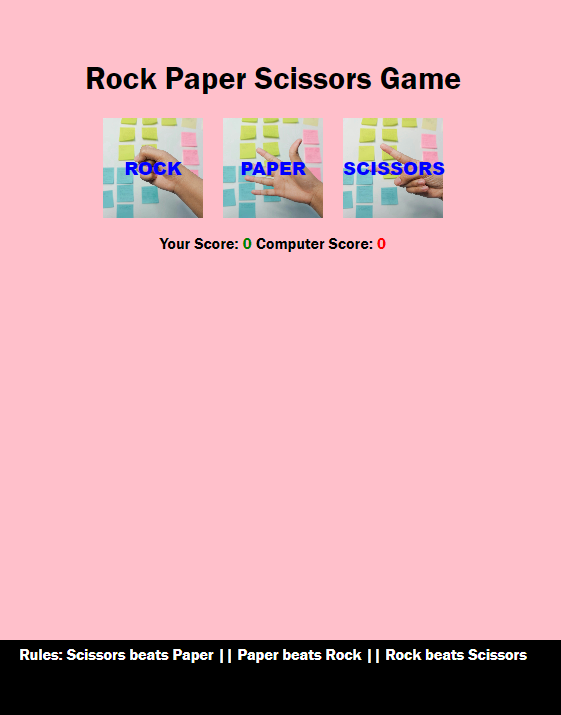
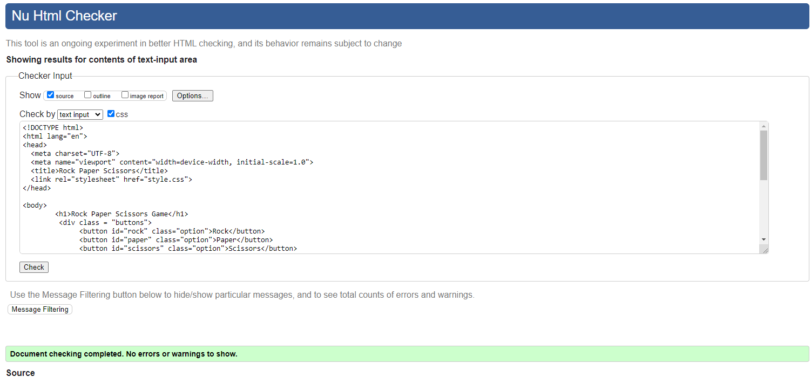
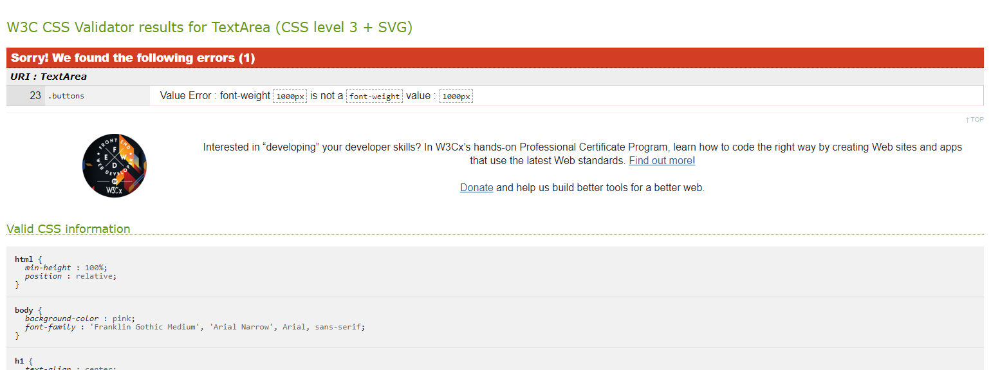
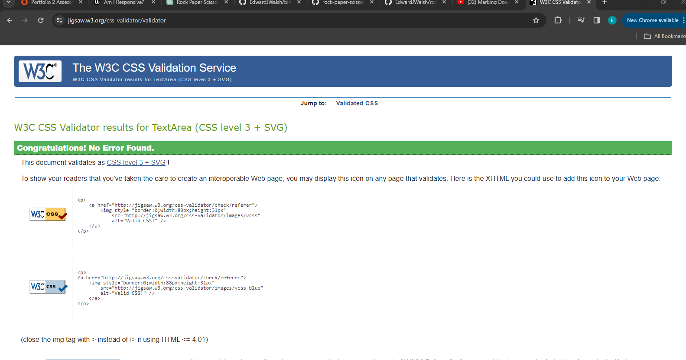
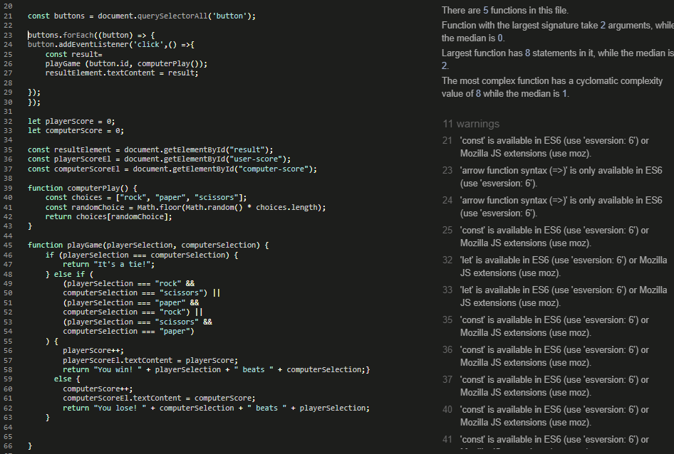
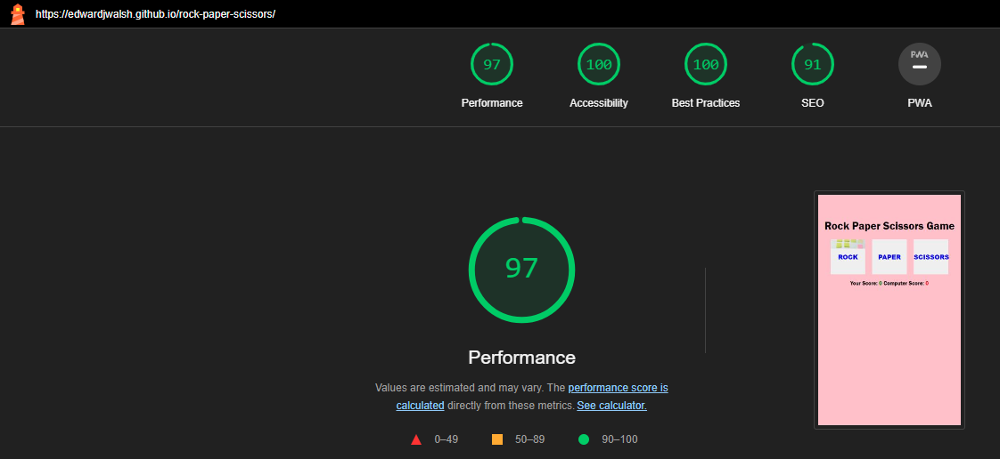

# Rock Paper Scissors Game

This website is for a simple Rock Paper Scissors game implemented in JavaScript, HTML and CSS. Fun for all ages!

This is how the site looks on various screen sizes:

## Features 

* Play Rock Paper Scissors against the computer
* Tracks wins, losses and ties
* Easy to use interface
* Rules at bottom of the page

## Testing

* I confirm that the game works correctly in a range of browsers. I used Opera, Chrome and Firefox.
* I tested it across a range of devices (a phone, an iPad, a laptop) and screen is responsive
* JavaScript is wokring as intended, the game keeps track of both the player and the computers scores.

## Bugs

I did not encounter any bugs while creating this project.

# Validator testing

I ran my HTML code through the W3C Markup Validation Service and came up with no errors:

I ran my CSS code through the W3C CSS Validation Service and initially had the following issue:

After fixing the issue and running the code again, it came up with no errors:

I ran my JavaScript vode through JSHint and got the following warnings. These warnings were not relevant at es6 was available. You can also see the Metrics in the below screenshot:

# Accessibility

I passed my code through the Lighthouse website checker and was happy with the results:

# Deployment

The page was deplied through GitHub Pages. The steps to deploy are as follows:

* In the GitHub repository, go to the Settings tab
* Go to the Pages section on the menu on the left hand side of the page
* In the Source drop-down menu select 'Deply from a branch'
* Under 'Branch' select 'Main'
* Select '/(root) in the Folder drop-down menu
* Select 'save'
* The link to the site will appear at the top of the screen with a link.

[The live link can be found here](https://edwardjwalsh.github.io/rock-paper-scissors/)

